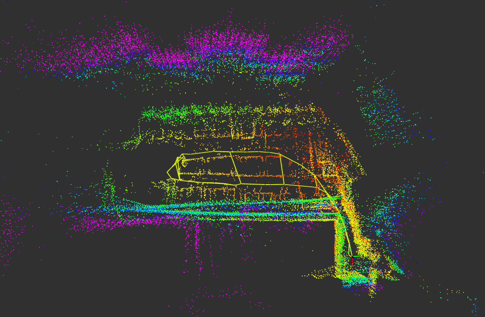
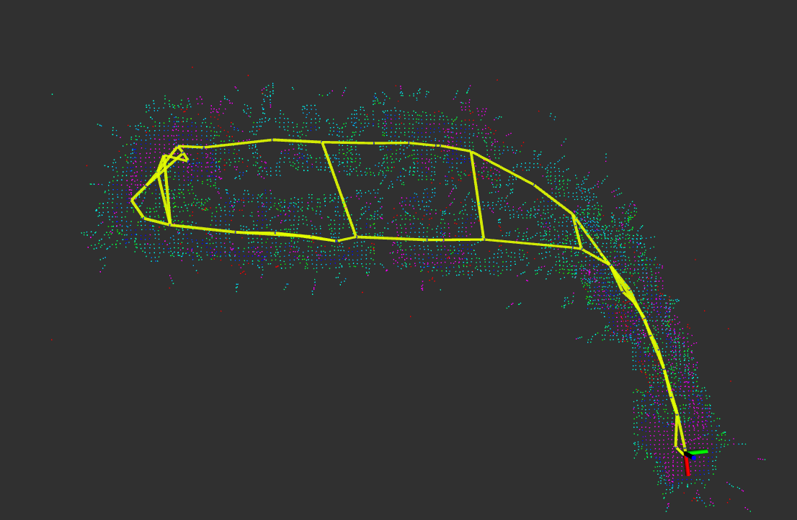

# 🤖 dddmr_navigation
# 🤖 dddmr_navigation

## 🚀 最新更新：支持 MID360 360° 激光雷达
已为 DDDMR Navigation Stack 适配了 MID360（MID 360）360° 激光雷达。适配内容包括配置文件、示例启动文件以及在 Ackermann 转向车辆上的建图、定位与规划的验证流程与参数示例。

👉 可以优先查看 `src/dddmr_lego_loam` 与 `src/dddmr_mcl_3dl` 中的 MID360 专用配置和 launch 文件。

---

## 🚀 亮点与演示
近期新增与优化包括：

- **MID360（360° LiDAR）建图与定位配置**
- **Ackermann 定制化规划与控制示例**
- **演示图片与示例输出（已内嵌）**

<p align='center'>
  
</p>

<p align='center'>
  
  
</p>

### 新增：全局规划演示 & 测试视频 🎬
我们新增了**全局规划演示图**和测试录像用于展示规划结果与点云匹配情况：

<p align='center'>
  
</p>

你也可以直接在仓库中播放测试视频：

<p align='center'>
  <!-- Embed converted GIF for inline preview on GitHub -->
  
</p>


---

> **说明：** DDDMR Navigation Stack 是对传统 2D 导航（如 Nav2）的扩展，支持多层地图、坡道/斜坡导航、基于点云的三维感知和语义清理等功能。

## ✅ 为什么选择 DDDMR（3D 导航）？

- 与 2D 导航用户工作流一致：建图 → 定位 → 规划与导航
- 能应对复杂地形（坡道、多层场景）
- 支持经济性硬件（例如 MID360、16 线激光雷达、Intel NUC/Jetson 等）

<p align='center'>
    
</p>

感谢来自 [Navigation](https://github.com/ros-planning/navigation) 与 [Navigation2](https://github.com/ros-navigation/navigation2) 等开源项目的贡献与启发。

如果刚入门，请查看入门指南： [dddmr_beginner_guide](https://github.com/dfl-rlab/dddmr_navigation/tree/main/src/dddmr_beginner_guide)

## 🛠 快速上手（简要）

1. 启动底盘和激光雷达：
```bash
# 示例：依赖 livox_ros_driver2 或您使用的 MID360 驱动
ros2 launch tianracer_bringup tianracer_bringup.launch.py
```
2. 启动建图或在线建图（示例）：
```bash
在线：ros2 launch lego_loam_bor lego_loam_ackermann_mid360.launch.py #目前受制于主控性能等原因，在线建图容易卡出
离线：ros2 launch lego_loam_bor lego_loam_ackermann_mid360_bag.launch.py #rosbag位置在launch文件中更改
建完保存：ros2 service call /save_mapped_point_cloud std_srvs/srv/Empty {} #地图将会被保存到src文件夹下类似“lego_map2025_12_29_10_13_05“下，其中”2025_12_29_10_13_05“是保存日期，根据不同的包而更改，请将该文件内所有文件移到lego_map文件夹中用于被加载
```
3. 启动定位导航：
```bash
定位：ros2 launch dddmr_mcl_3dl mcl_3dl.launch.py config_file:=ackermann_mid360_localization.yaml
规划导航：ros2 launch p2p_move_base dddmr_navigation_with_map_loading.launch.py
```


---

## 🏁 各包详细文档
<details><summary> <b>💡 Click me to see Mapping</b> </summary>
https://github.com/dfl-rlab/dddmr_navigation/tree/main/src/dddmr_lego_loam
</details>
<details><summary> <b>💡 Click me to see Localization</b> </summary>
https://github.com/dfl-rlab/dddmr_navigation/tree/main/src/dddmr_mcl_3dl
</details>
<details><summary> <b>💡 Click me to see Perception</b> </summary>
https://github.com/dfl-rlab/dddmr_navigation/tree/main/src/dddmr_perception_3d
</details>
<details><summary> <b>💡 Click me to see Global planner</b> </summary>
https://github.com/dfl-rlab/dddmr_navigation/tree/main/src/dddmr_global_planner
</details>
<details><summary> <b>💡 Click me to see Local planner</b> </summary>
https://github.com/dfl-rlab/dddmr_navigation/tree/main/src/dddmr_local_planner
</details>
<details><summary> <b>💡 Click me to see Move base</b> </summary>
https://github.com/dfl-rlab/dddmr_navigation/tree/main/src/dddmr_p2p_move_base
</details>

## Demonstrations of DDD navigation functions
<table align='center'>
  <tr width="100%">
    <td width="50%"><p align='center'>3D mapping</p></td>
    <td width="50%"><p align='center'>3D global planning</p></td>
  </tr>
  <tr width="100%">
    <td><p align='center'>3D local planning</p></td>
    <td><p align='center'>3D navigation</p></td>
  </tr>
  <tr width="100%">
    <td><p align='center'>Support vairant sensors (Unitree G4)</p></td>
    <td><p align='center'>Support vairant sensors (Depth Camera)</p></td>
  </tr>
</table>

